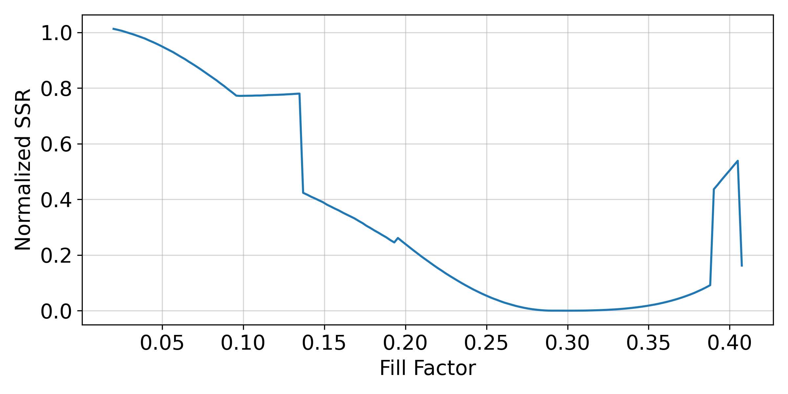

# Inverse Design Algorithm for Optomechanical Crystals

Creating an inverse design algorithm for optomechanical crystals. This code was for
an undergraduate thesis during September 2022 to April 2023 under the supervision of
Dr. Paul Barclay. The bulk of the code was written in MATLAB 2021b and COMSOL with the 
testing and implementation being in the MATLAB notebooks. However, any plots were 
created by saving the data and using Python instead.

Many thanks to Waleed El-Sayed for providing the COMSOL models, base code, and guidance
throughout the project. Most of the code to obtain the bandgap was mainly this 
original code reorganized, documented, and cleaned up for usage in this algorithm.

## Table of Contents
* [Installation](#installation)
* [Usage](#usage)
* [Future Development](#future-development)

## Installation

In order to run the code, COMSOL and MATLAB are required. It was tested on MATLAB 2021b
utilizing COMSOL LiveLive for MATLAB to run the COMSOL models from MATLAB directly. The
COMSOL models are included in the repository located in the `mphFiles` folder. **Please
note** they need to be unzipped first into the same directory before using them.

For the Python code, only the numpy, scipy, and matplotlib packages are required.

## Usage

The main code demonstrating the inverse design algorithm is found in the `TestInverseDesign.mlx`
MATLAB notebook. The testing for calculating the bandgap can been seen in `TestCalculatingBandgap.mlx`,
but each one of the steps in that notebook are separated into the many `.m` files in
the root directory. `lossFunction.m` is perhaps the most important file as it contains
the loss function that is being minimized. Each of the other files are helper functions
that perform each of the steps in the algorithm.

The other MATLAB notebooks were testing out different aspects of 
the inverse design algorithm, such as the effects of the wavenumber resolution in the
COMSOL simulation or analyzing the entire parameter space of the loss function utilized. 
The data created in those MATLAB notebooks were saved and then used in the Python 
notebooks to create the plots. The parameter space of the function can be seen, for
example, in the plot below.

## Future Development

So far, the inverse design algorithm has been shown to work for finding the optimal
fill factor for a desired bandgap width and center frequency. Many future additions 
can be added onto this such as the inclusion of the mechanical bandgap into the 
loss function, alongside the optical one presently. With the general loss function
presented, exploration of different minimization algorithms could be done as well to
help with the convergence of the algorithm. Machine learning and global optimization
would be neat to see. Eventually, expanding the algorithm to cover a general unit cell
shape would be the next major step improvements.